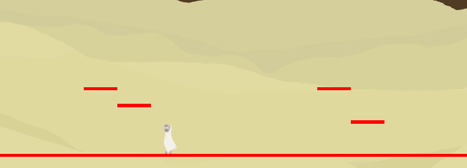
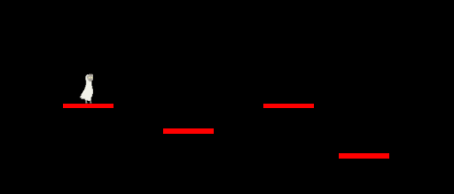
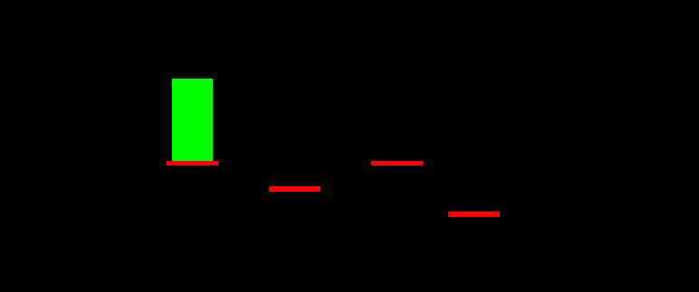

<h1>Introduction</h1>
Hey there!

To start with – it isn’t a tutorial series. I wanted to start a blog to motivate myself even more to start and finish DirectX 11 project. If anyone would find it inspiring or will learn anything from me, I would  be really happy, even if that’s not the point of this blog.

Project itself is a remake of 2D Platformer game that I’ve made with my friend for Ludum Dare 36
<a href="https://azargaz.itch.io/ancient-drone">https://azargaz.itch.io/ancient-drone</a>. This time I’d like to make it from scratch using DirectX 11. I will create flipbook animation system, basic physics engine, enemies with simple AI and other things essential to complete this remake. Let’s get started!

<h2>Week #3</h2>
As I implemented animation pipeline in previous week, I used it for three basic player animations. In case if player is standing still, idle animation is playing. There is also movement animation and jump animation which freezes at last frame and doesn't loop (based on boolean).

Other major improvement was setting transparency on spritesheet. I colored spritesheet transparent color as pink (1, 0, 1) and in pixelshader I'm checking if chosen pixel is transparent or not

<pre><code class="cpp">
float4 ColorPixelShader(PixelInputType input) : SV_TARGET
{
	float4 textureColor = shaderTexture.Sample(SampleType, float2(input.tex.x, input.tex.y));	

	float alpha = textureColor.r + textureColor.b;
	textureColor.a = 1.0f - ( alpha - normalize(textureColor.g) * 2.0f );
	textureColor *= normalize(textureColor.a);

   	return textureColor;
}
</code></pre>

First, I am summing red and blue channel (if red = 1.0 and blue = 1.0 then we're getting pink). So we need alpha variable to be 2.0. Next line is really interesing - in the brackets we check if there green channel is 0.0. If green is different, then it will be normalized to 1.0, multiplied to 2.0 and so we will get value equal to 0.0 in brackets and finally alpha channel will be 1.0 so it will be fully opaque. Last line is to convert to black color (0, 0, 0, 0) when alpha is 0.0.

<a href="https://github.com/komilll/AncientDroneRemake/releases/tag/0.3">https://github.com/komilll/AncientDroneRemake/releases/tag/0.3</a> - Week #3 release

<i>Week #1: Gif #3 – Player full animations</i>

<h2>Week #2</h2>
This week I was preparing animation pipeline. It's based on simply importing whole 2D sprite sheet and slicing it to get frames we'd like to use further. Currently (and it'll be propably enough for this project) there is only "fixed size" slice option, which means that after specifying number of frames, row and size of single sprite, you are getting animation sequence that can be simply used.

It doesn't use any recognizion systems so it has to be controlled by user (but Unity works similar except that it throws away empty frames). Major downside is that there isn't transparency introduced. My idea is to create .dds with pink background and use it as translucent color then, but I'll have to improve animation pipeline first.

I'm kinda disappointed with this week because I had a lot of things going on university and I got a little seek on the weekend so I programmed like 6-7 hours this week but it doesn't mean I didn't like little animation that I've produced and which you can see below.

<a href="https://github.com/komilll/AncientDroneRemake/releases/tag/0.2">https://github.com/komilll/AncientDroneRemake/releases/tag/0.2</a> - Week #2 release

<i>Week #1: Gif #2 – Player idle animation</i>

<h2>Week #1</h2>
To begin our adventure I’ve prepared basic pipeline for rendering 2D images. Image is created simply by rendering rectangle (2 triangles) with specified size and color. In future I will implement textures (or even .png files) importing to allow using sprites. Base of my pipeline is based on Rasterek tutorial, up until #4 tutorial - <a href="http://www.rastertek.com/dx11tut04.html">http://www.rastertek.com/dx11tut04.html</a>. I highly recommend his tutorial series to begin with DirectX 11 programming.

Second thing that I needed to start working on game was physics engine. Currently it’s horrible primitive but that’s enough for jumping on platforms (and so enough for PLATFORMer game). In each model instance I’ve added physics bounds. Each object has its bounds initialized on creation but they can be modified if we’d like for example enemies to have larger colliders or make player’s vulnerability collider smaller than model itself. Physics is based on simple comparisons in FixedUpdate() (I derived this name from Unity engine as an Update with fixed timestep):

<pre><code class="cpp">
bool isFalling = true;
bool isGround = false;

if (jumping)
{
	isFalling = false;
	//Add positive velocity
}
//We are calculating further only if player is standing on ground or is falling and thus can interact with platform in air
if (player.min.y - groundThickness <= ground.max.y)
{
	//Player standing on platform
	if (player.min.x < ground.max.x && player.max.x > ground.min.x)
	{
		isFalling = false;
		isGround = true;
	}
	else if (player.max.x < ground.max.x)
	{
		if (ground.min.x - player.max.x <= 0.0f && velocity > 0.0f)
			//Snap to left side of platform		
	}
	else if (player.min.x > ground.min.x)
	{
		if (-(player.min.x - ground.max.x) >= 0.0f && velocity < 0.0f)
			//Snap to right side of platform
	}
}

if (isFalling)
	//Apply gravity
</code></pre>

And that’s all. I’m simply testing 4 states: player jumping, player standing on ground, player moving inside platform from left side (snap to left), player moving inside platform from right side (snap to right). If player isn’t jumping and isn’t standing on ground then it must be falling so I apply gravity in that case scenario.

After every week progress I will post new release version with changes that I’ve made through that week. Thank you for reading and once again – Let the adventure begin!

<a href="https://github.com/komilll/AncientDroneRemake/releases/tag/0.1">https://github.com/komilll/AncientDroneRemake/releases/tag/0.1</a> - Week #1 release

<i>Week #1: Gif #1 – Jumping on platforms using basic physics engine</i>

